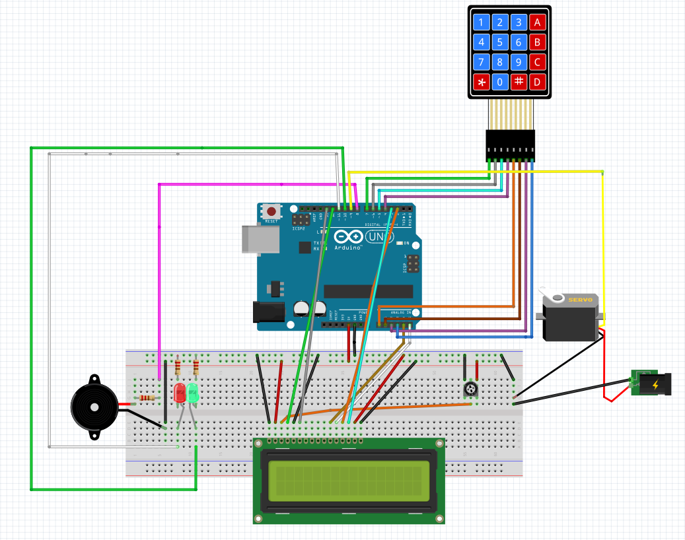

# 🔐 AVR & Python Gesture-Based Authentication System / System uwierzytelniania oparty na gestach (AVR & Python)

## 📌 Description / Opis
This project integrates an AVR microcontroller with Python-based gesture recognition to create a secure authentication system. The system consists of a keypad, an LCD display, a servo motor, and a Python script that processes hand gestures and communicates with the AVR microcontroller via UART.

Ten projekt integruje mikrokontroler AVR z systemem rozpoznawania gestów w Pythonie, tworząc bezpieczny system uwierzytelniania. System składa się z klawiatury, wyświetlacza LCD, serwomechanizmu oraz skryptu w Pythonie, który przetwarza gesty dłoni i komunikuje się z mikrokontrolerem AVR za pomocą UART.

## ⭐ Features / Funkcje
- **Keypad PIN Entry / Wprowadzanie PIN-u:** Users enter a PIN on a 4x4 keypad. / Użytkownik wprowadza PIN na klawiaturze 4x4.
- **LCD Display / Wyświetlacz LCD:** Displays authentication status and user prompts. / Wyświetla status uwierzytelnienia i komunikaty dla użytkownika.
- **Gesture Recognition / Rozpoznawanie gestów:** Uses Python and OpenCV to analyze hand gestures. / Używa Pythona i OpenCV do analizy gestów dłoni.
- **Secure Access Control / Zabezpieczona kontrola dostępu:** If the PIN is correct, the system waits for a valid hand gesture before granting access. / Jeśli PIN jest poprawny, system czeka na prawidłowy gest dłoni przed przyznaniem dostępu.
- **Servo Motor Control / Sterowanie serwomechanizmem:** Unlocks a mechanism (e.g., door lock) upon successful authentication. / Odblokowuje mechanizm (np. zamek) po pomyślnym uwierzytelnieniu.

## 🔄 How It Works / Jak to działa?
1. The user enters a PIN on the keypad. / Użytkownik wpisuje PIN na klawiaturze.
2. If the PIN is correct, the system prompts the user to perform a specific hand gesture. / Jeśli PIN jest poprawny, system prosi o wykonanie konkretnego gestu dłoni.
3. The Python script captures and processes the gesture. / Skrypt w Pythonie przechwytuje i przetwarza gest.
4. If the gesture matches the expected pattern, Python sends a confirmation signal via UART. / Jeśli gest pasuje do oczekiwanego wzorca, Python wysyła sygnał potwierdzający przez UART.
5. The AVR microcontroller receives the signal and activates the servo motor to unlock access. / Mikrokontroler AVR odbiera sygnał i aktywuje serwomechanizm, aby odblokować dostęp.

## 🖥️ Machine Learning & Gesture Recognition / Uczenie maszynowe i rozpoznawanie gestów
The gesture recognition system uses **OpenCV** and a **pre-trained machine learning model** to classify hand gestures. The model is trained on a dataset of common hand gestures, allowing the system to recognize specific movements accurately.

System rozpoznawania gestów wykorzystuje **OpenCV** oraz **wytrenowany model uczenia maszynowego** do klasyfikacji gestów dłoni. Model został przeszkolony na zbiorze danych zawierającym popularne gesty, co pozwala na dokładne rozpoznawanie ruchów dłoni.

### 🛠️ How the gesture recognition works? / Jak działa rozpoznawanie gestów?
1. **Image Capture / Przechwytywanie obrazu:** The camera captures frames of the user's hand.
2. **Preprocessing / Przetwarzanie wstępne:** OpenCV filters and processes the image to detect hand contours.
3. **Feature Extraction / Ekstrakcja cech:** The system extracts key features (e.g., finger positions, angles).
4. **Classification / Klasyfikacja:** A trained machine learning model classifies the gesture.
5. **Communication with AVR / Komunikacja z AVR:** If the gesture is valid, a signal is sent to the AVR microcontroller via UART.

## 🛒 Hardware Requirements / Wymagania sprzętowe
- AVR-based microcontroller (e.g., ATmega328P)
- 4x4 Keypad
- 16x2 LCD Display
- Servo Motor
- USB-UART Adapter (for serial communication)
- Camera (for gesture recognition)

## 📥 Software Requirements / Wymagania programowe
- Arduino IDE (for AVR programming)
- Python 3.x
- OpenCV (for gesture recognition)
- PySerial (for UART communication)
- NumPy (for image processing)

## 🔧 Installation & Setup / Instalacja i konfiguracja
### AVR Microcontroller
1. Flash the provided AVR firmware to the microcontroller using the Arduino IDE. / Wgraj dostarczone oprogramowanie AVR do mikrokontrolera za pomocą Arduino IDE.
2. Connect the keypad, LCD, and servo motor according to the wiring diagram. / Podłącz klawiaturę, wyświetlacz LCD i serwomechanizm zgodnie ze schematem połączeń.
3. Ensure UART communication is set to **9600 baud, 8N1 (8 data bits, no parity, 1 stop bit).** / Upewnij się, że komunikacja UART jest ustawiona na **9600 baud, 8N1 (8 bitów danych, bez parzystości, 1 bit stopu).**

### Python Gesture Recognition
1. Install required Python libraries: / Zainstaluj wymagane biblioteki Pythona:
   ```bash
   pip install opencv-python numpy pyserial
   ```
2. Connect a webcam for gesture recognition. / Podłącz kamerę do rozpoznawania gestów.
3. Run the Python script: / Uruchom skrypt Pythona:
   ```bash
   python gesture_recognition.py
   ```
4. The script will analyze hand gestures and send a signal to the AVR when the correct gesture is detected. / Skrypt przeanalizuje gesty dłoni i wyśle sygnał do AVR po wykryciu prawidłowego gestu.

## 🎥 Demo
### 📹 Video / Wideo


### 🖼️ Screenshots / Zrzuty ekranu


## 🤝 Contribution / Współpraca
Feel free to contribute by improving gesture detection accuracy or enhancing the hardware setup. Open a pull request with your modifications!

Zachęcamy do współpracy nad ulepszaniem systemu rozpoznawania gestów lub usprawnieniem sprzętu. Otwórz pull request ze swoimi zmianami!

## 📜 License / Licencja
This project is open-source under the MIT License.

Ten projekt jest open-source na licencji MIT.

